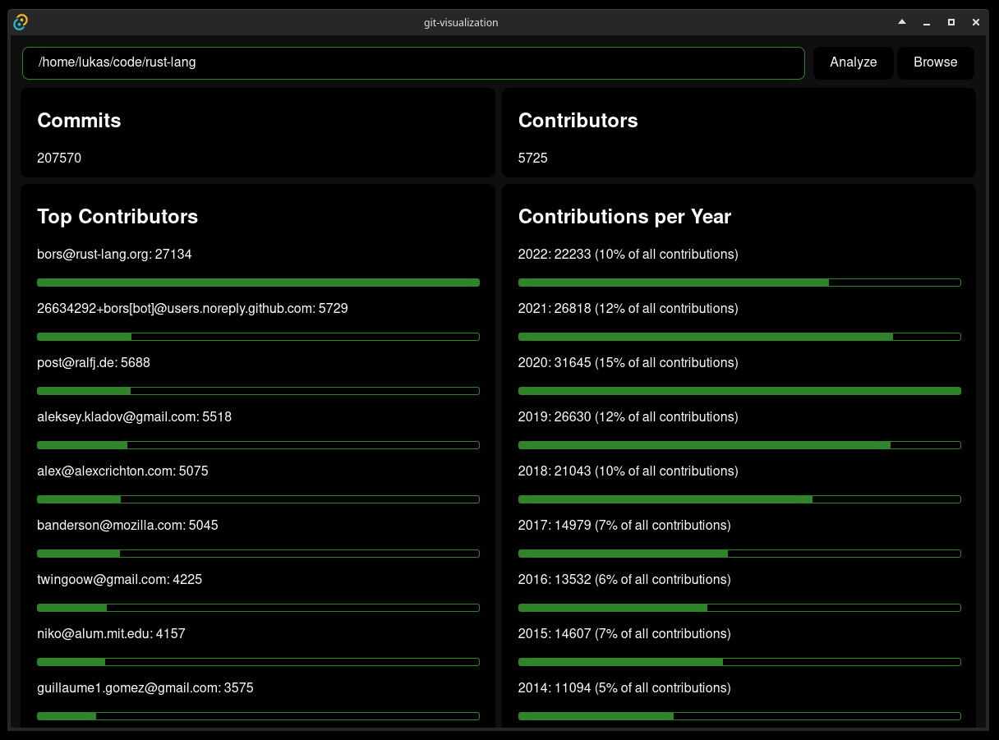
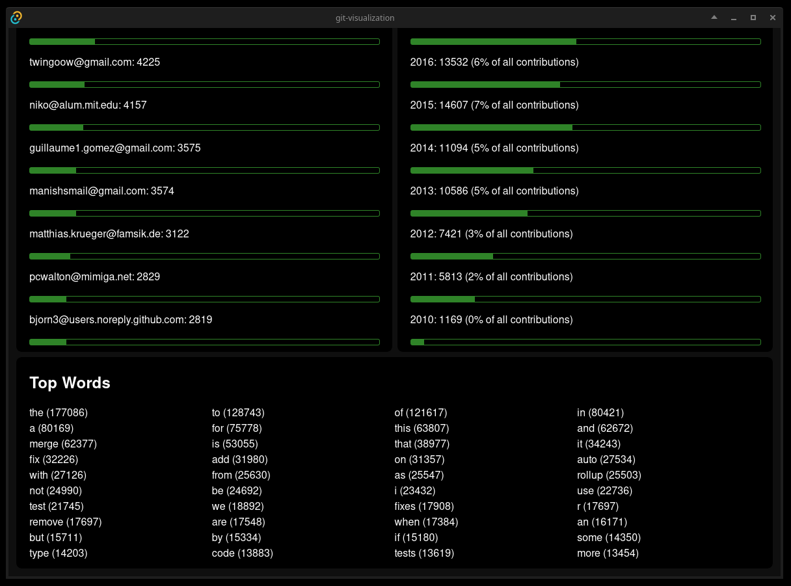

# Missing Semester Homework 1 (Git Visualization)

> Displays some statistics about a git repository. Created with tauri and yew.

## Screenshots





## Setup

```bash
# https://tauri.app/v1/guides/getting-started/prerequisites
cargo install tauri-cli
cargo install --locked trunk
rustup target add wasm32-unknown-unknown

cargo tauri dev # or cargo tauri build
```

